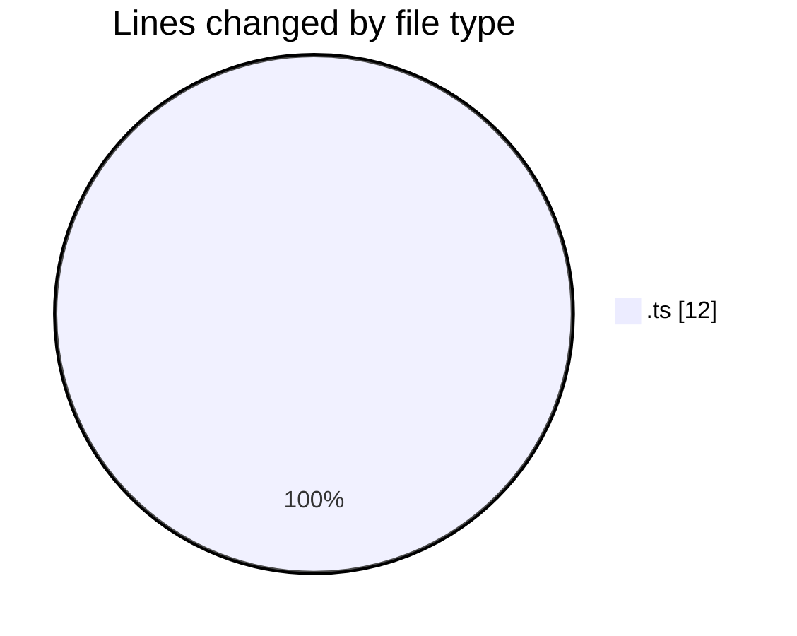
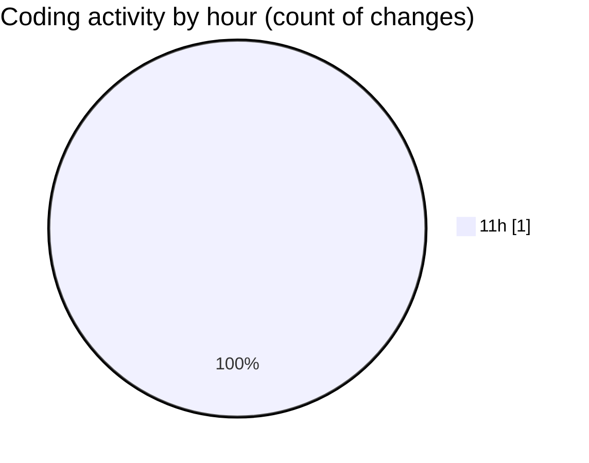

# budget_front_nest - Activity Summary 

## Overall Statistics

| Stat                   | Value                                                             |
| ---------------------- | ----------------------------------------------------------------- |
| **Lines Added** (➕)   | 12                                          |
| **Lines Removed** (➖) | 0                                        |
| **Net Change** (↕)    | 12                |
| **Active Time** (⌚)   | 0 minute |

## Modified Files
- **environment.ts** (+12, -0)

## Visualizations

### By File Type (Lines Changed)

### By Hour (Estimated Activity Count)

> **Last Updated:** 29.12.2025, 11:20:49