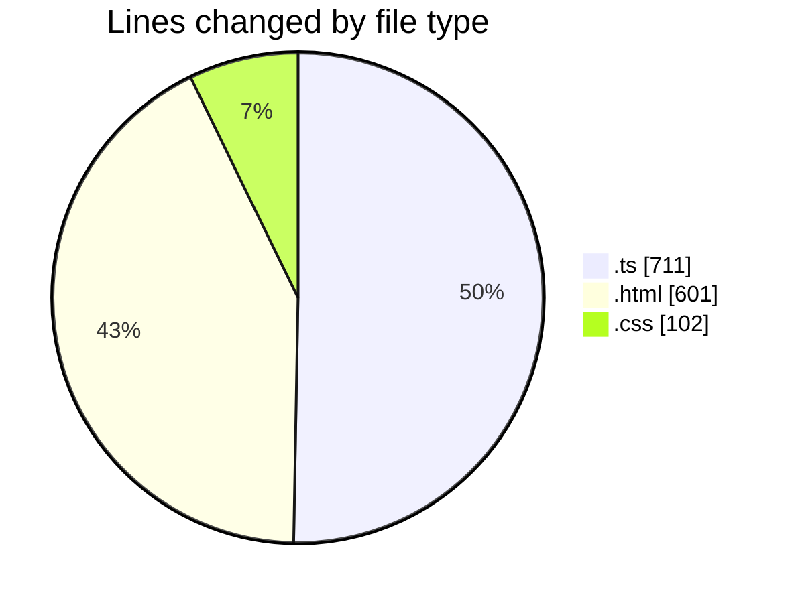
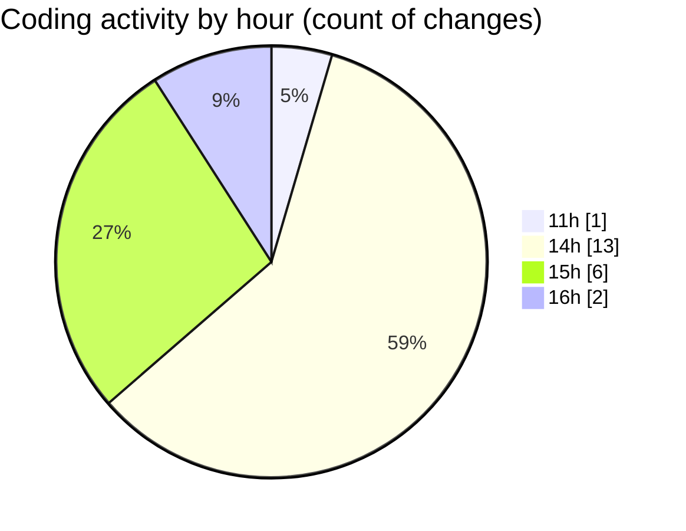

# budget_front_nest - Activity Summary 

## Overall Statistics

| Stat                   | Value                                                             |
| ---------------------- | ----------------------------------------------------------------- |
| **Lines Added** (➕)   | 1282                                          |
| **Lines Removed** (➖) | 132                                        |
| **Net Change** (↕)    | 1150                |
| **Active Time** (⌚)   | 28 minutes |

## Modified Files
- **environment.ts** (+12, -0)
- **credit-contract-element.component.html** (+477, -124)
- **credit-contract.service.ts** (+163, -0)
- **credit-contract-element.component.ts** (+536, -0)
- **credit-contract-element.component.css** (+94, -8)

## Visualizations

### By File Type (Lines Changed)

### By Hour (Estimated Activity Count)

> **Last Updated:** 29.12.2025, 16:03:04