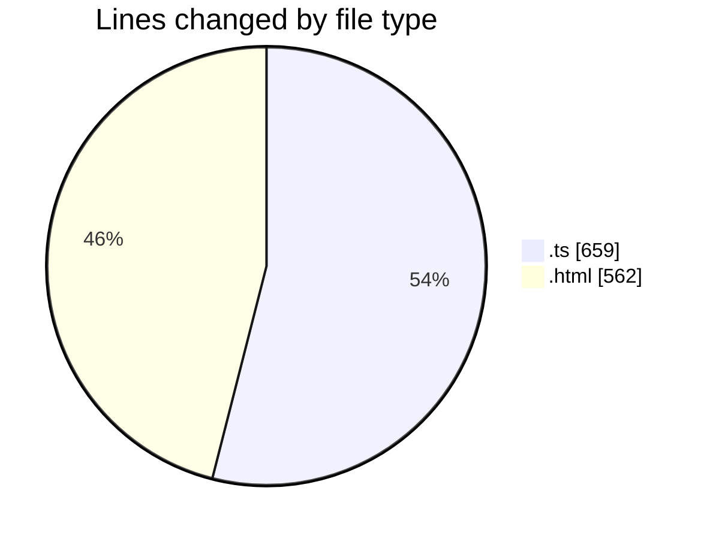
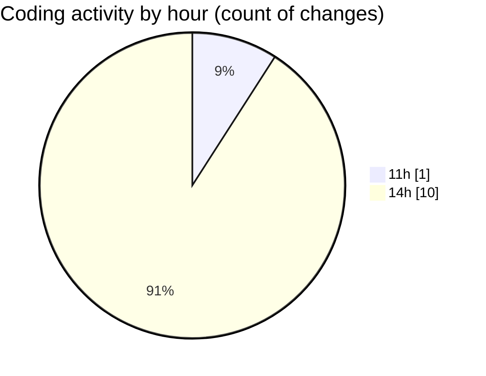

# budget_front_nest - Activity Summary 

## Overall Statistics

| Stat                   | Value                                                             |
| ---------------------- | ----------------------------------------------------------------- |
| **Lines Added** (➕)   | 1105                                          |
| **Lines Removed** (➖) | 116                                        |
| **Net Change** (↕)    | 989                |
| **Active Time** (⌚)   | 11 minutes |

## Modified Files
- **environment.ts** (+12, -0)
- **credit-contract-element.component.html** (+446, -116)
- **credit-contract.service.ts** (+147, -0)
- **credit-contract-element.component.ts** (+500, -0)

## Visualizations

### By File Type (Lines Changed)

### By Hour (Estimated Activity Count)

> **Last Updated:** 29.12.2025, 14:26:11