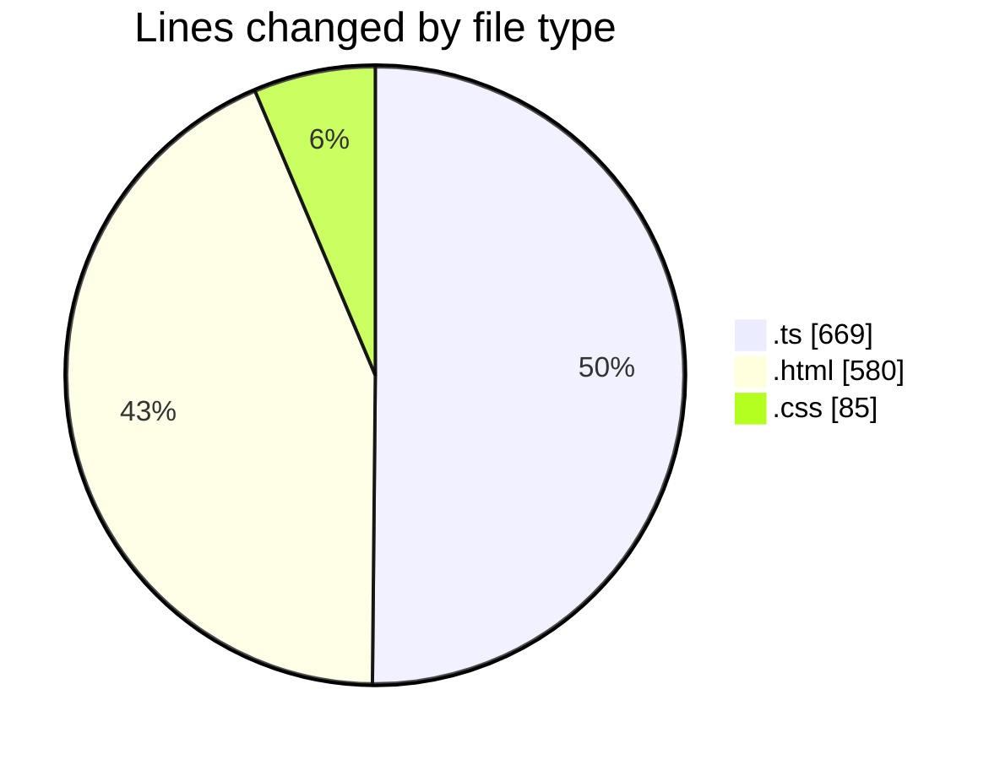
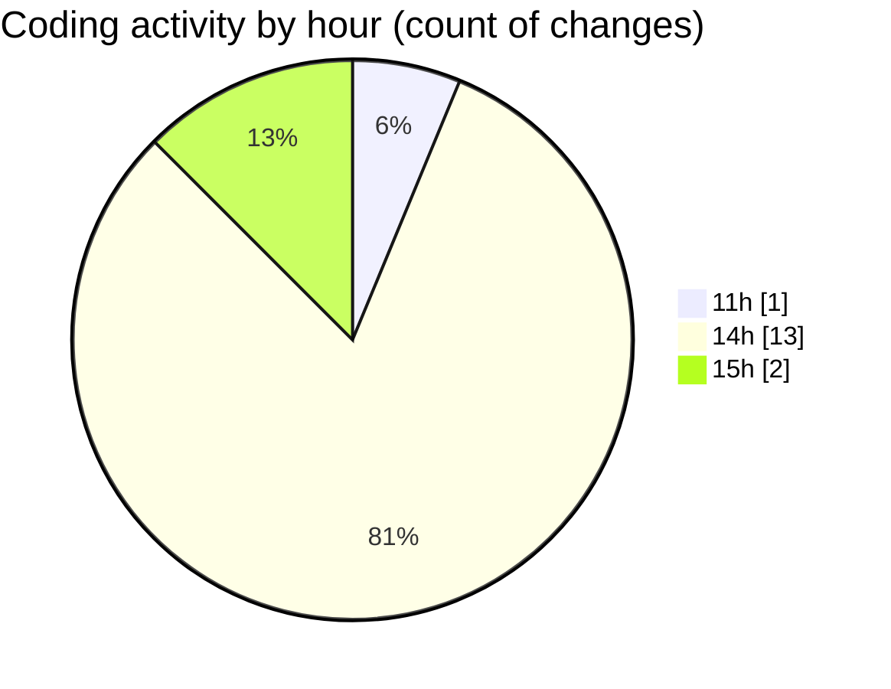

# budget_front_nest - Activity Summary 

## Overall Statistics

| Stat                   | Value                                                             |
| ---------------------- | ----------------------------------------------------------------- |
| **Lines Added** (➕)   | 1210                                          |
| **Lines Removed** (➖) | 124                                        |
| **Net Change** (↕)    | 1086                |
| **Active Time** (⌚)   | 21 minutes |

## Modified Files
- **environment.ts** (+12, -0)
- **credit-contract-element.component.html** (+456, -124)
- **credit-contract.service.ts** (+157, -0)
- **credit-contract-element.component.ts** (+500, -0)
- **credit-contract-element.component.css** (+85, -0)

## Visualizations

### By File Type (Lines Changed)

### By Hour (Estimated Activity Count)

> **Last Updated:** 29.12.2025, 15:48:04