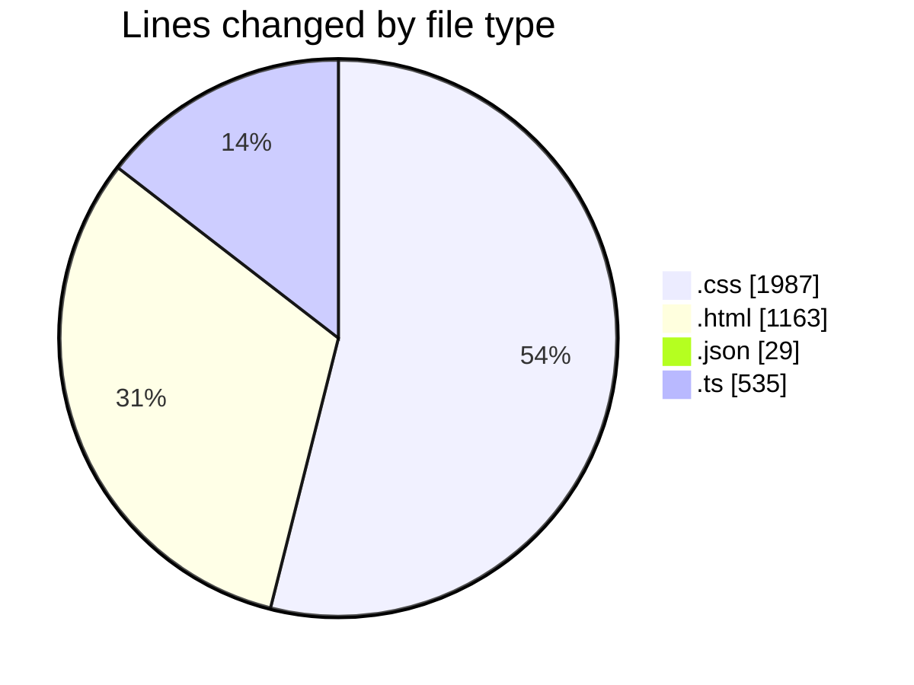
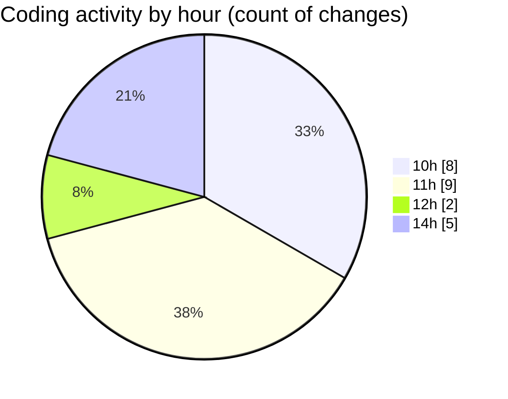

# budget_front_nest - Activity Summary 

## Overall Statistics

| Stat                   | Value                                                             |
| ---------------------- | ----------------------------------------------------------------- |
| **Lines Added** (➕)   | 3706                                          |
| **Lines Removed** (➖) | 8                                        |
| **Net Change** (↕)    | 3698                |
| **Active Time** (⌚)   | 25 minutes |

## Modified Files
- **styles.css** (+474, -5)
- **credit-contract-list.component.html** (+120, -0)
- **currency-list.component.html** (+106, -0)
- **import243-list.component.html** (+95, -0)
- **admin-panel.component.html** (+368, -0)
- **profile.component.css** (+339, -1)
- **profile.component.html** (+121, -0)
- **dashboard.component.css** (+479, -0)
- **admin-panel.component.css** (+564, -0)
- **settings.json** (+29, -0)
- **credit-contract-element.component.css** (+123, -2)
- **credit-contract-element.component.ts** (+535, -0)
- **credit-contract-element.component.html** (+353, -0)

## Visualizations

### By File Type (Lines Changed)

### By Hour (Estimated Activity Count)

> **Last Updated:** 30.12.2025, 14:47:43