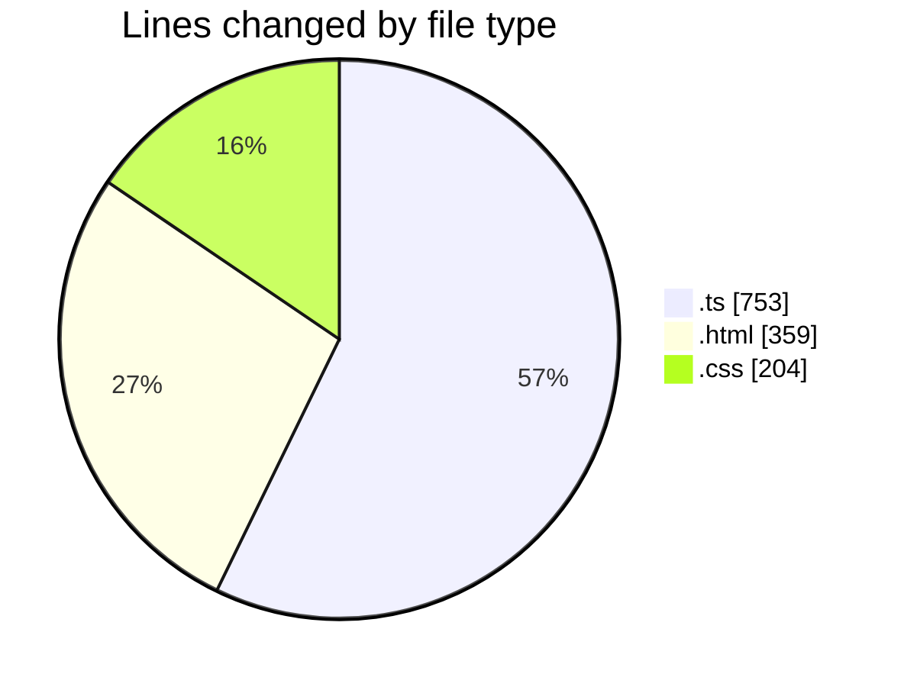
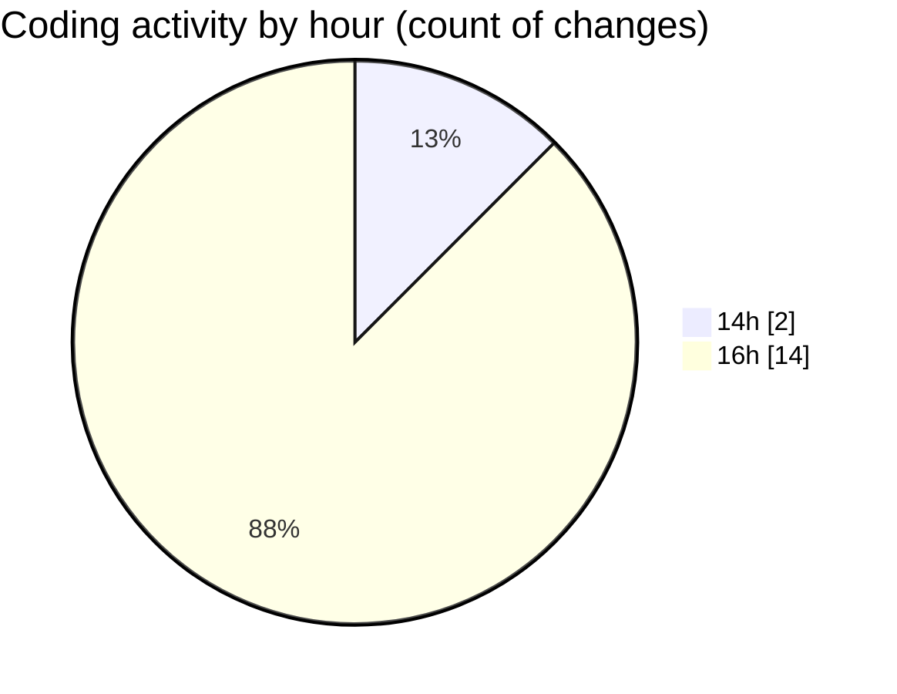

# budget_front_nest - Activity Summary 

## Overall Statistics

| Stat                   | Value                                                             |
| ---------------------- | ----------------------------------------------------------------- |
| **Lines Added** (➕)   | 1316                                          |
| **Lines Removed** (➖) | 0                                        |
| **Net Change** (↕)    | 1316                |
| **Active Time** (⌚)   | 26 minutes |

## Modified Files
- **environment.ts** (+14, -0)
- **credit-contract.service.ts** (+174, -0)
- **credit-contract-element.component.html** (+359, -0)
- **credit-contract-element.component.ts** (+565, -0)
- **credit-contract-element.component.css** (+204, -0)

## Visualizations

### By File Type (Lines Changed)

### By Hour (Estimated Activity Count)

> **Last Updated:** 05.01.2026, 16:33:04