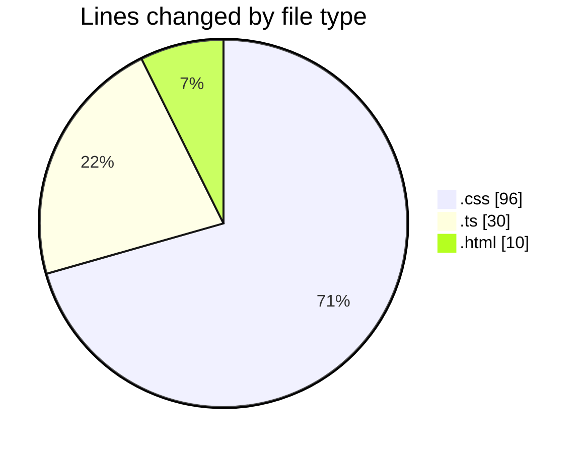
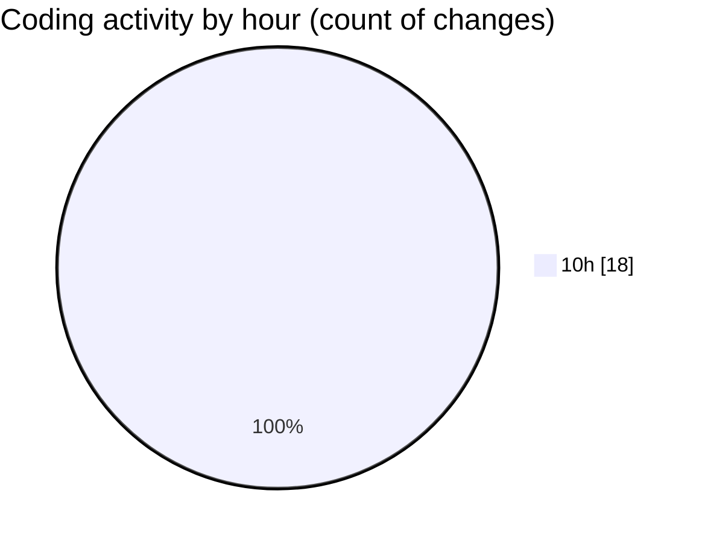

# budget_front_nest - Activity Summary 

## Overall Statistics

| Stat                   | Value                                                             |
| ---------------------- | ----------------------------------------------------------------- |
| **Lines Added** (➕)   | 121                                          |
| **Lines Removed** (➖) | 15                                        |
| **Net Change** (↕)    | 106                |
| **Active Time** (⌚)   | 21 minutes |

## Modified Files
- **credit-contract-element.component.css** (+46, -3)
- **payment-delete-confirm.component.ts** (+27, -0)
- **payment-delete-confirm.component.html** (+9, -1)
- **payment-delete-confirm.component.css** (+36, -11)
- **credit-contract-element.component.ts** (+3, -0)

## Visualizations

### By File Type (Lines Changed)

### By Hour (Estimated Activity Count)

> **Last Updated:** 06.01.2026, 10:59:19