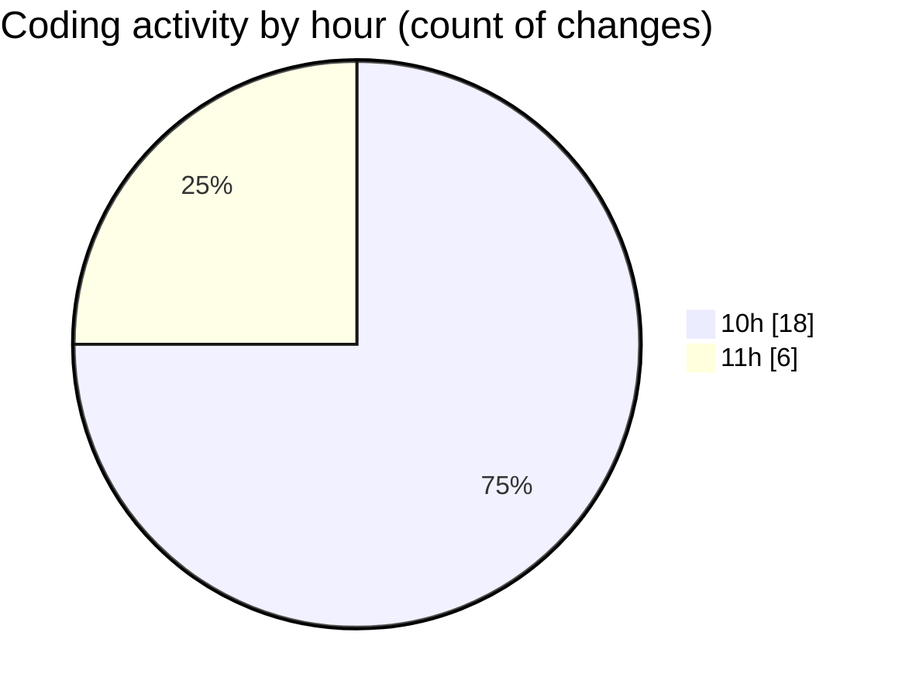

# budget_front_nest - Activity Summary 

## Overall Statistics

| Stat                   | Value                                                             |
| ---------------------- | ----------------------------------------------------------------- |
| **Lines Added** (➕)   | 545                                          |
| **Lines Removed** (➖) | 60                                        |
| **Net Change** (↕)    | 485                |
| **Active Time** (⌚)   | 31 minutes |

## Modified Files
- **credit-contract-element.component.css** (+459, -3)
- **payment-delete-confirm.component.ts** (+27, -0)
- **payment-delete-confirm.component.html** (+9, -8)
- **payment-delete-confirm.component.css** (+47, -46)
- **credit-contract-element.component.ts** (+3, -3)

## Visualizations

### By File Type (Lines Changed)

### By Hour (Estimated Activity Count)

> **Last Updated:** 06.01.2026, 11:40:57