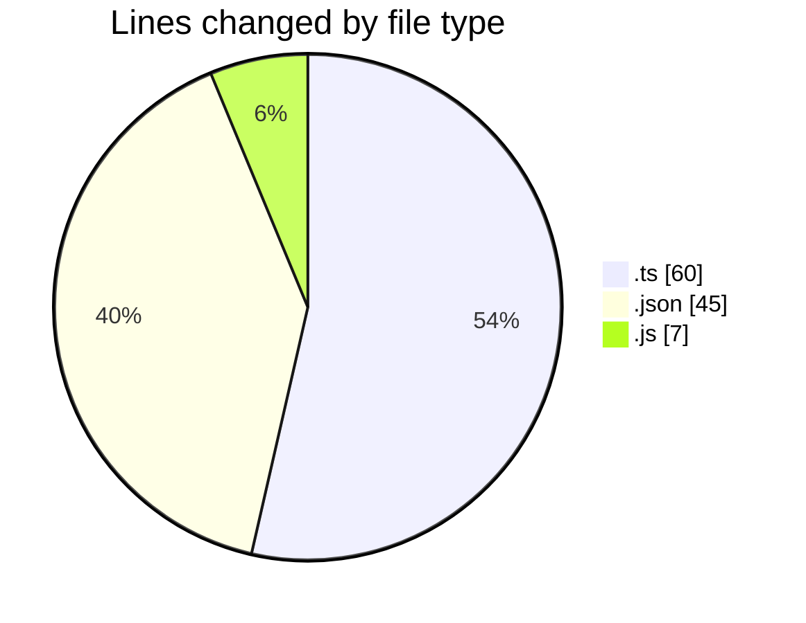
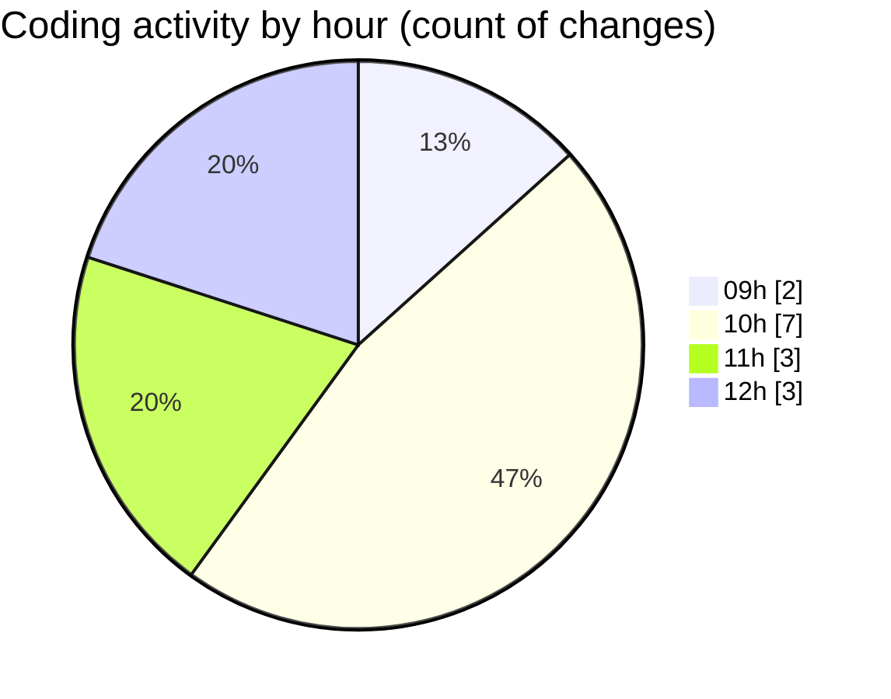

# typescript - Activity Summary 

## Overall Statistics

| Stat                   | Value                                                             |
| ---------------------- | ----------------------------------------------------------------- |
| **Lines Added** (➕)   | 93                                          |
| **Lines Removed** (➖) | 19                                        |
| **Net Change** (↕)    | 74                |
| **Active Time** (⌚)   | 12 minutes |

## Modified Files
- **index.ts** (+2, -0)
- **tsconfig.json** (+45, -0)
- **index.js** (+6, -1)
- **index.ts** (+40, -18)

## Visualizations

### By File Type (Lines Changed)

### By Hour (Estimated Activity Count)

> **Last Updated:** 02.03.2026, 12:10:51