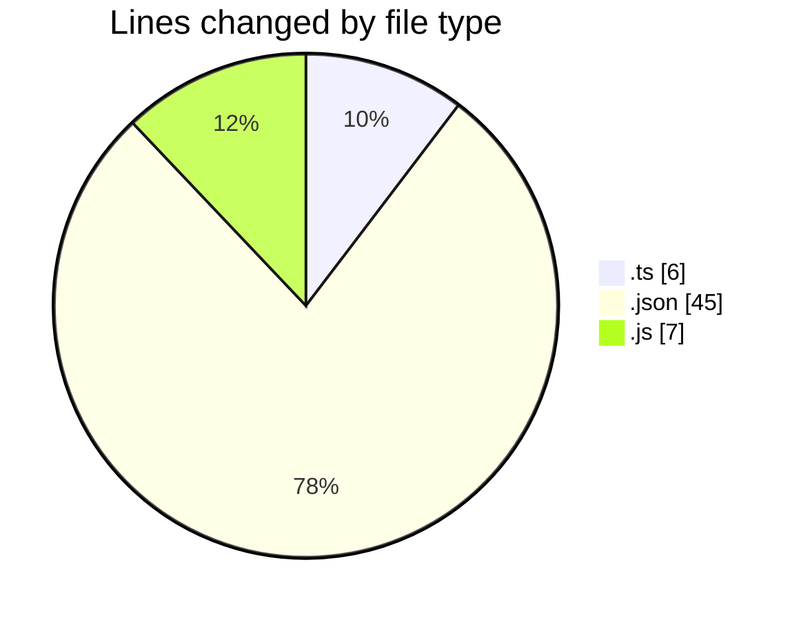
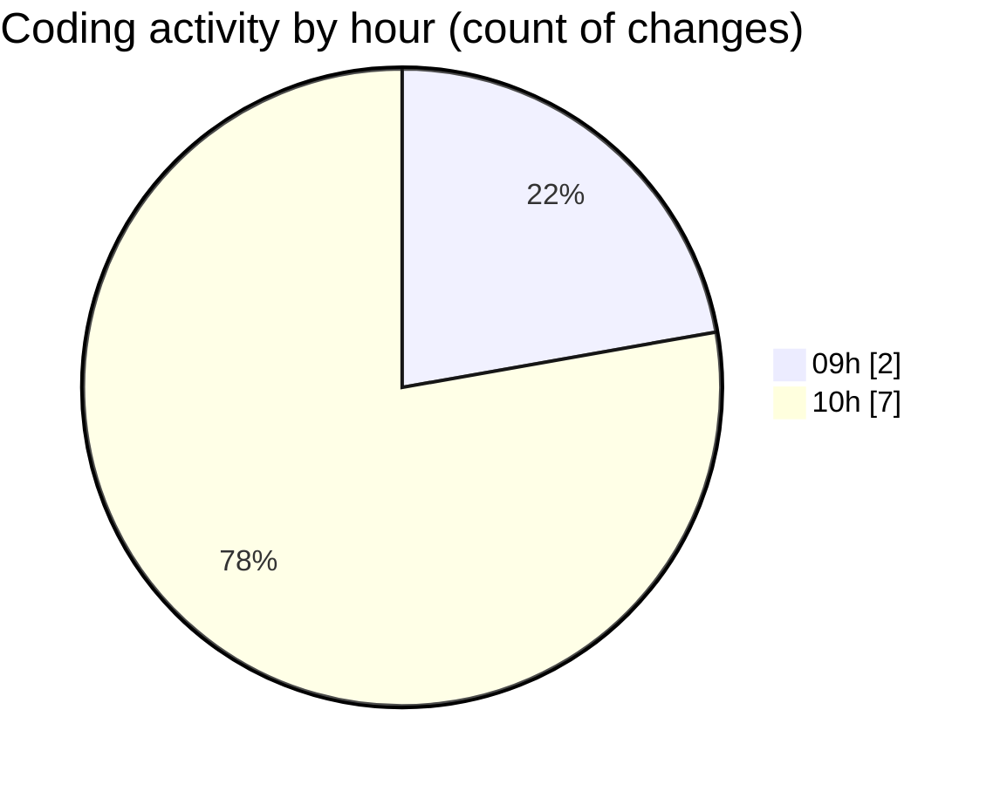

# typescript - Activity Summary 

## Overall Statistics

| Stat                   | Value                                                             |
| ---------------------- | ----------------------------------------------------------------- |
| **Lines Added** (➕)   | 56                                          |
| **Lines Removed** (➖) | 2                                        |
| **Net Change** (↕)    | 54                |
| **Active Time** (⌚)   | 8 minutes |

## Modified Files
- **index.ts** (+2, -0)
- **tsconfig.json** (+45, -0)
- **index.js** (+6, -1)
- **index.ts** (+3, -1)

## Visualizations

### By File Type (Lines Changed)

### By Hour (Estimated Activity Count)

> **Last Updated:** 02.03.2026, 10:25:38