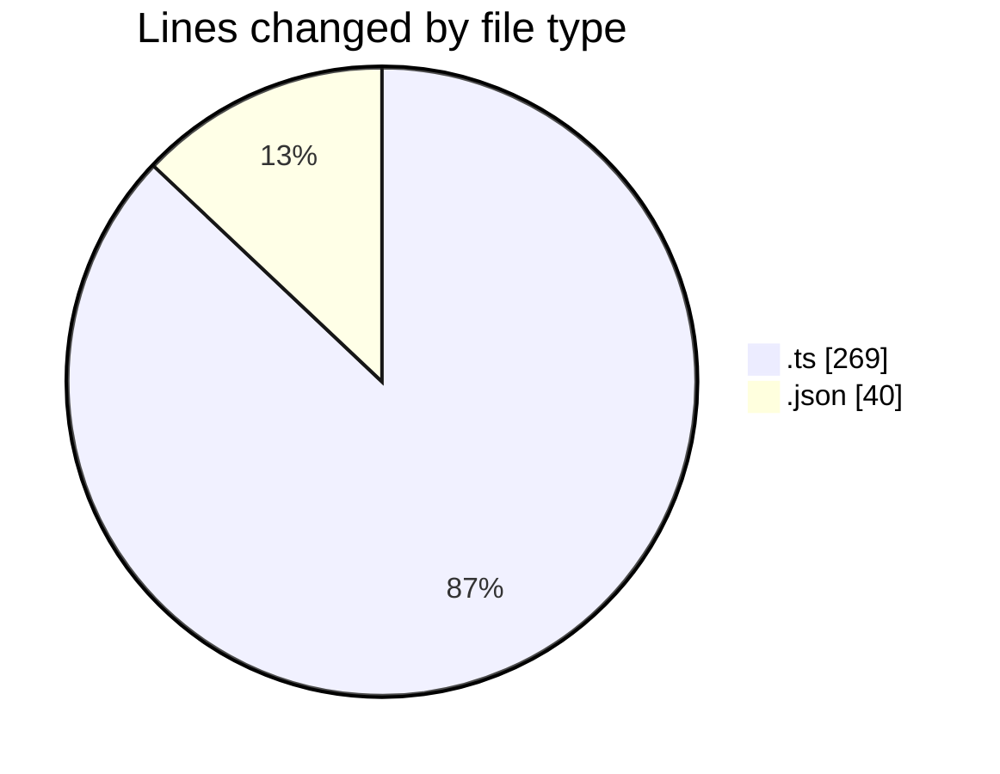
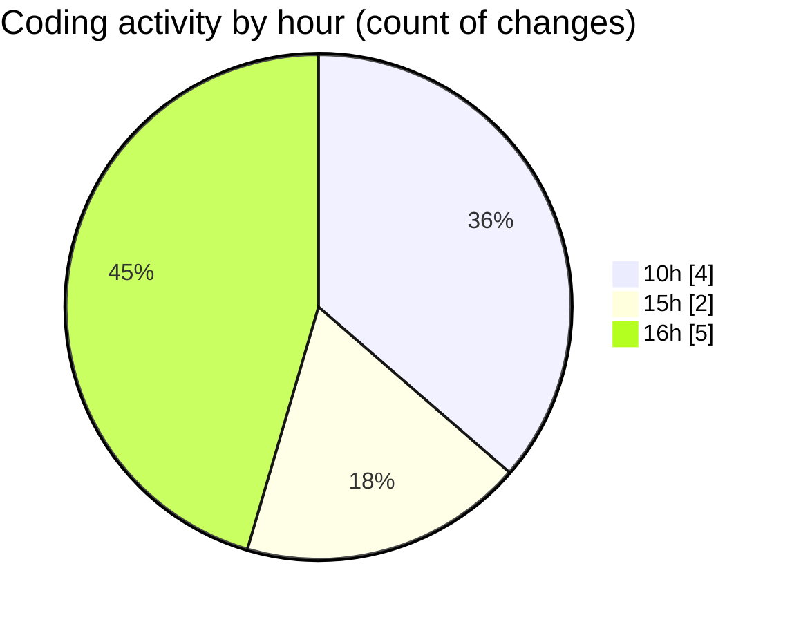

# typescript - Activity Summary 

## Overall Statistics

| Stat                   | Value                                                             |
| ---------------------- | ----------------------------------------------------------------- |
| **Lines Added** (➕)   | 307                                          |
| **Lines Removed** (➖) | 2                                        |
| **Net Change** (↕)    | 305                |
| **Active Time** (⌚)   | 10 minutes |

## Modified Files
- **index.ts** (+269, -0)
- **settings.json** (+38, -2)

## Visualizations

### By File Type (Lines Changed)

### By Hour (Estimated Activity Count)

> **Last Updated:** 03.03.2026, 16:12:19