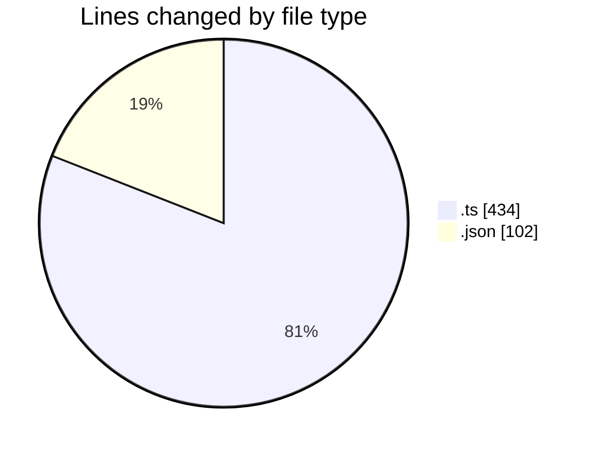
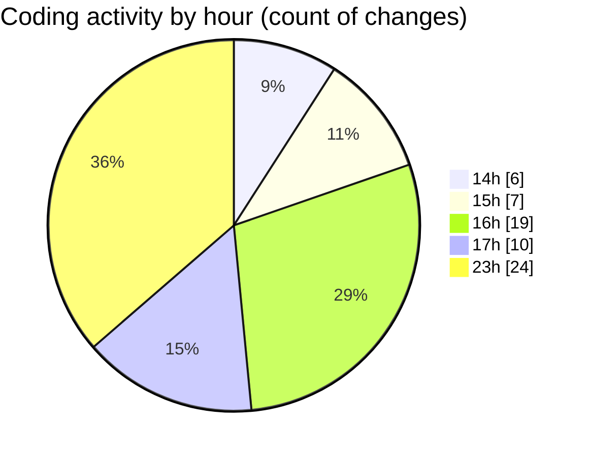

# cinema - Activity Summary 

## Overall Statistics

| Stat                   | Value                                                             |
| ---------------------- | ----------------------------------------------------------------- |
| **Lines Added** (➕)   | 480                                          |
| **Lines Removed** (➖) | 56                                        |
| **Net Change** (↕)    | 424                |
| **Active Time** (⌚)   | 90 minutes |

## Modified Files
- **app.module.ts** (+95, -13)
- **seat.entity.ts** (+10, -0)
- **film.entity.ts** (+25, -9)
- **type_ticket.entity.ts** (+24, -0)
- **schedule.entity.ts** (+38, -0)
- **hall.entity.ts** (+12, -0)
- **keybindings.json** (+23, -0)
- **main.ts** (+20, -0)
- **package.json** (+79, -0)
- **create-type_ticket.dto.ts** (+9, -0)
- **update-type_ticket.dto.ts** (+11, -0)
- **type_ticket.controller.ts** (+37, -20)
- **type_ticket.service.ts** (+34, -12)
- **app.controller.ts** (+15, -2)
- **type_ticket.module.ts** (+13, -0)
- **films.module.ts** (+10, -0)
- **film.entity.ts** (+25, -0)

## Visualizations

### By File Type (Lines Changed)

### By Hour (Estimated Activity Count)

> **Last Updated:** 30.03.2026, 23:33:17