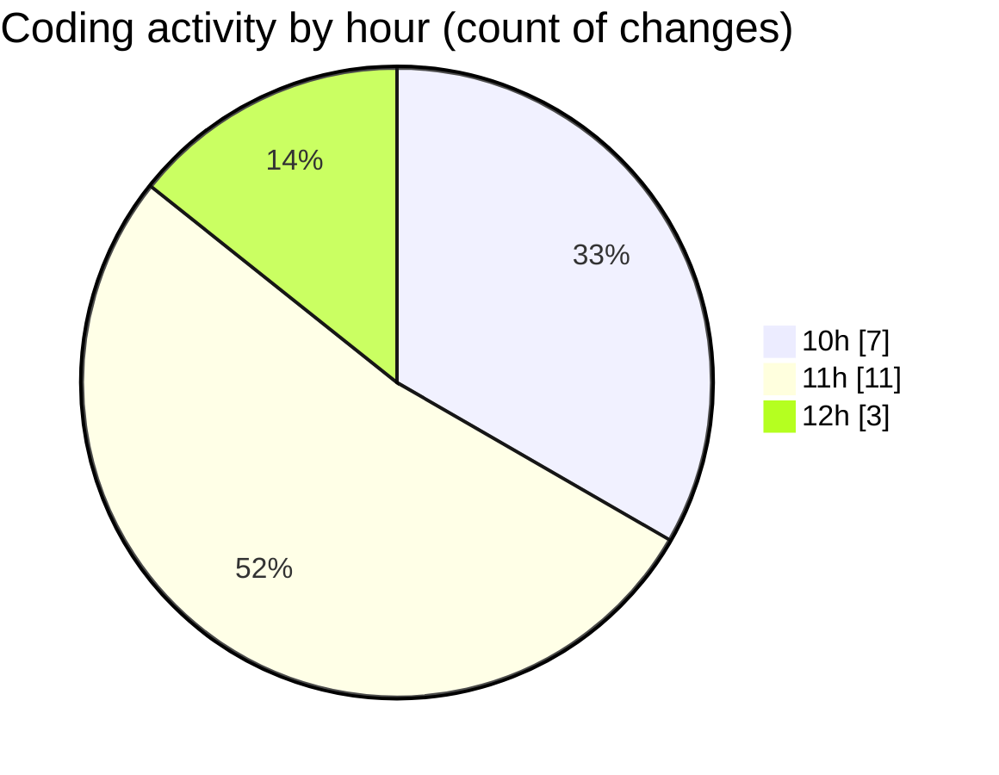

# cinema - Activity Summary 

## Overall Statistics

| Stat                   | Value                                                             |
| ---------------------- | ----------------------------------------------------------------- |
| **Lines Added** (➕)   | 214                                          |
| **Lines Removed** (➖) | 8                                        |
| **Net Change** (↕)    | 206                |
| **Active Time** (⌚)   | 31 minutes |

## Modified Files
- **films.module.ts** (+3, -3)
- **hall.entity.ts** (+19, -0)
- **app.module.ts** (+4, -0)
- **schedule.controller.ts** (+35, -0)
- **schedule.service.ts** (+27, -0)
- **film.entity.ts** (+4, -0)
- **create-schedule.dto.ts** (+13, -0)
- **hall.controller.ts** (+35, -0)
- **films.controller.ts** (+35, -0)
- **type_ticket.controller.ts** (+26, -5)
- **type_ticket.service.ts** (+13, -0)

## Visualizations

### By File Type (Lines Changed)

### By Hour (Estimated Activity Count)

> **Last Updated:** 31.03.2026, 12:02:58