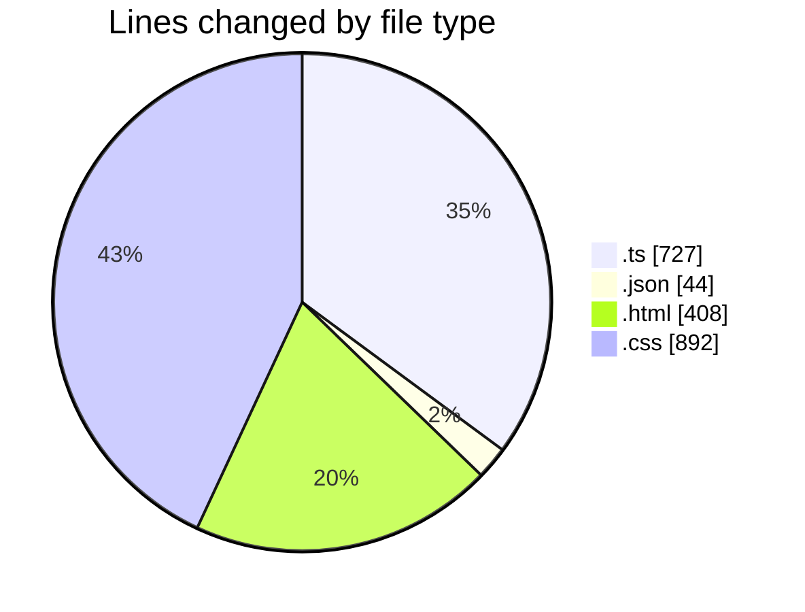
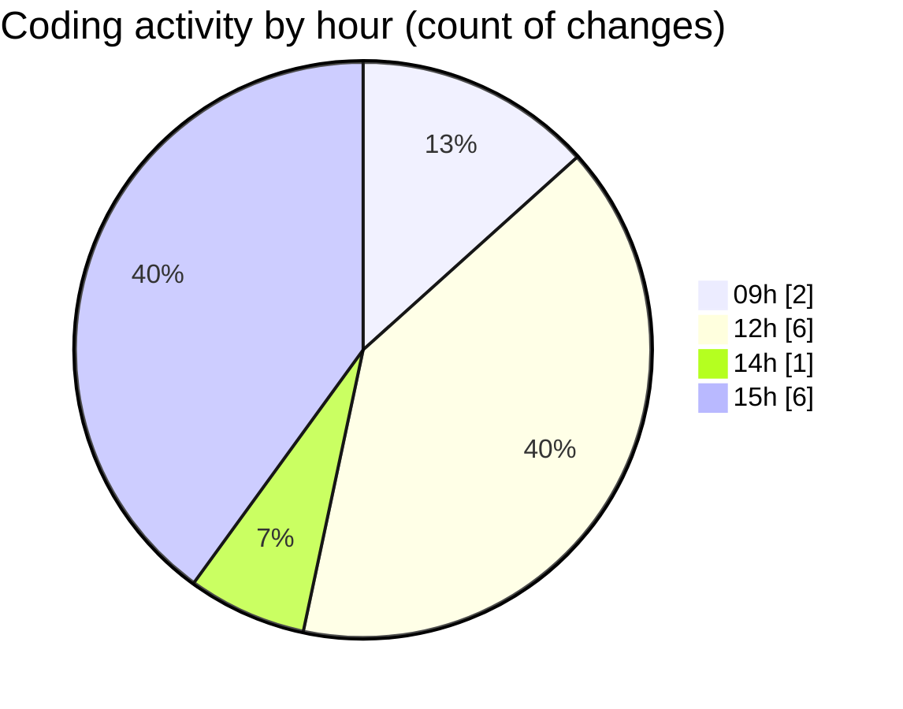

# cinema 3 - Activity Summary 

## Overall Statistics

| Stat                   | Value                                                             |
| ---------------------- | ----------------------------------------------------------------- |
| **Lines Added** (➕)   | 2053                                          |
| **Lines Removed** (➖) | 18                                        |
| **Net Change** (↕)    | 2035                |
| **Active Time** (⌚)   | 11 minutes |

## Modified Files
- **api.config.ts** (+2, -0)
- **main.ts** (+41, -0)
- **settings.json** (+41, -3)
- **app.module.ts** (+54, -0)
- **expense.component.ts** (+563, -0)
- **expense.component.html** (+393, -15)
- **expense.service.ts** (+67, -0)
- **expense.component.css** (+892, -0)

## Visualizations

### By File Type (Lines Changed)

### By Hour (Estimated Activity Count)

> **Last Updated:** 16.06.2026, 15:42:36