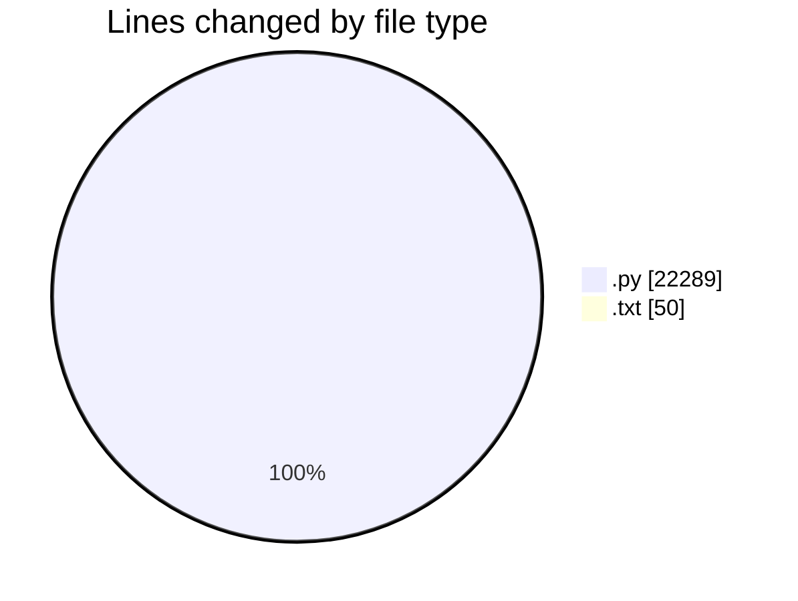
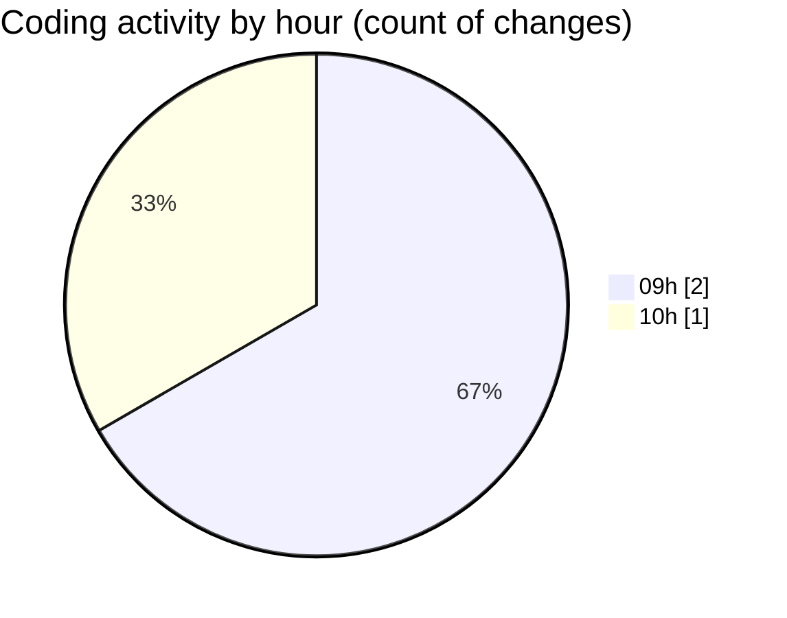

# BUDJET_BACK - Activity Summary 

## Overall Statistics

| Stat                   | Value                                                             |
| ---------------------- | ----------------------------------------------------------------- |
| **Lines Added** (➕)   | 22339                                          |
| **Lines Removed** (➖) | 0                                        |
| **Net Change** (↕)    | 22339                |
| **Active Time** (⌚)   | 2 minutes |

## Modified Files
- **views.py** (+14969, -0)
- **views_org.py** (+7320, -0)
- **requirements.txt** (+50, -0)

## Visualizations

### By File Type (Lines Changed)

### By Hour (Estimated Activity Count)

> **Last Updated:** 21.07.2026, 10:12:37